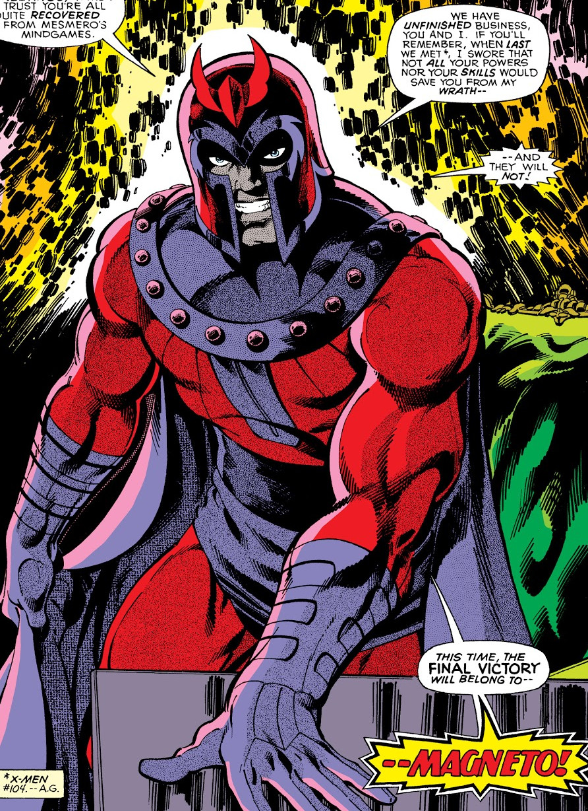

# EZ-readme-creator   
_*Built With*_         
JavaScript,HTML,ES6,Node

## Table of Contents
* [Description](#description)
* [Installation](#installation)
* [Usage](#usage)
* [License](#license)
* [Contributing](#contributing)
* [Tests](#tests)
* [Questions](#questions)

### Description 
This is a great project. It creates readme.md files out of thin air. Just answer some questions, and Boom!

### Installation 
asdfaf afaf afafa fafa fff afafdf afadaf faf affafaf fafff ffaf afaf f.

### Usage 
a fafa ffaf f f af af faf f afa f dsfafsfafaf fafafa fa fafaf afa faffaf a faff.

### License 
APACHE

### Contributing 
Chris S. Module 9 of the boot camp.

### Tests 
N/A at this time

### Questions 
Contact: Sam Davenport  
https://github.com/steadysamwise4  
samueldavenport@att.net
    
