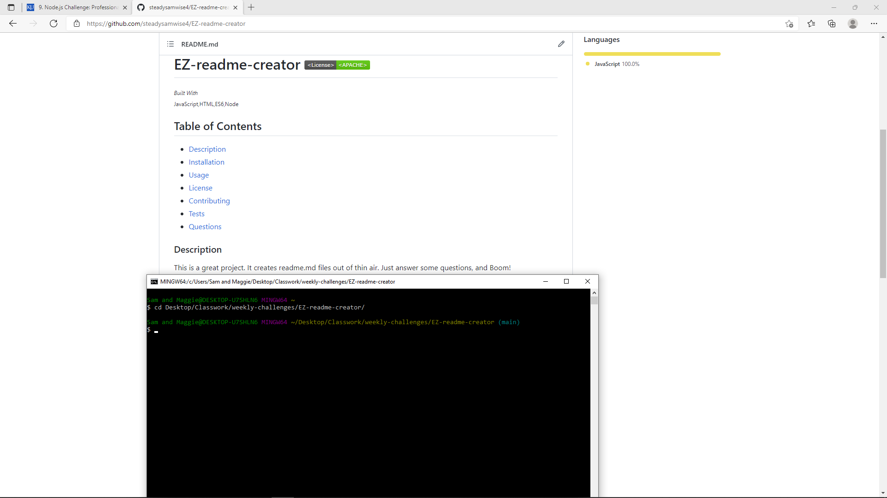

# EZ-readme-creator   

## Table of Contents
* [Description](#description)
* [Installation](#installation)
* [Usage](#usage)
* [License](#license)
* [References](#reference)
* [Contributing](#contributing)
* [Tests](#tests)
* [Questions](#questions)

## Description 
_***Built With:***_ JavaScript,HTML,ES6,Node
With this app you will save time creating professional readme.md files.

## Installation 
clone the repo to your computer.

## Usage 
run node index in the command line.

## License 
[CC](https://creativecommons.org/licenses/by/4.0/)

## References 
Christopher Sinlasath

## Contributing 
[Contributing Guidelines](./docs/contribute.txt)

## Tests 
N/A at this time

## Questions 
Contact: Sam Davenport  
https://github.com/steadysamwise4  
samueldavenport@att.net
    
